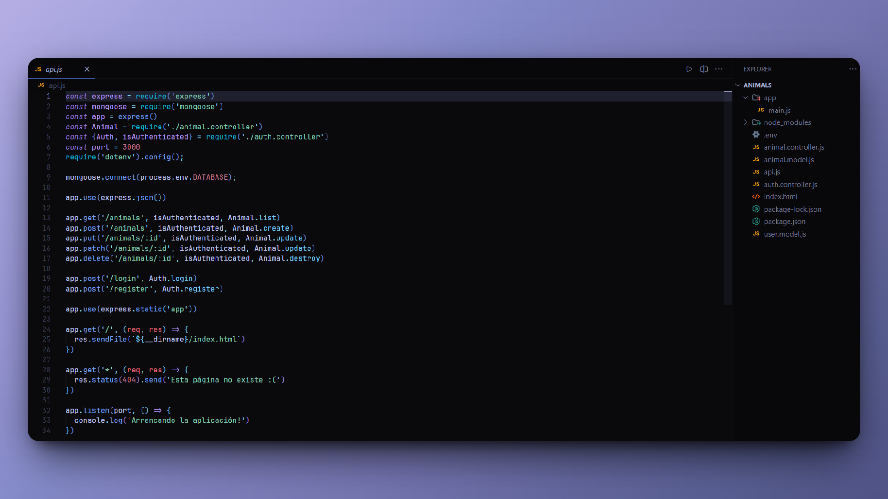

<h1 align="center">Animal Registration and Management System 🐾</h1>

<p align="left">
<a href="README_ES.md" target="_blank">
Ver README en Español
</a>
</p>

<p>
This project is a backend application that allows users to register, log in, and add animals with name and type data. It was developed to learn how to implement secure authentication using bcrypt to encrypt passwords and jsonwebtoken to manage access tokens with best practices.
</p>

---

<h1 align="center">Technologies Used</h1>
<div align="center"> 
 
 
 

</div>

---
<h1 align="center">Objective</h1>

The main objective of this project was:

1. Learn how to implement secure authentication with JWT.
2. Practice handling passwords encrypted with bcrypt.
3. Consolidate knowledge of Express and MongoDB by creating a functional authentication system.

---

<h1 align="center">Main Features</h1>

- **User Registration:**
  - Save users to the database with passwords encrypted using bcrypt.

- **Path Protection:**
  - Only authenticated users can add animals.

- **Animal Management:**
  - Allows authenticated users to add animals with name and type information.

- **Security Best Practices:**
  - Secure password encryption.
  - Secure tokens for user sessions.

---

<h1 align="center">Skills Acquired</h1>

Through this project, I learned to:

- Configure and use bcrypt to encrypt and verify passwords.
- Create and validate JWT tokens with jsonwebtoken.
- Secure routes in Express using express-jwt.
- Integrate authentication with CRUD operations in MongoDB.
- Improve the structure and modularity of the backend code.

---

<h1 align="center">Installation</h1>

1. Clone this repository to your local machine:

```bash
git clone https://github.com/JordanMedinaOrtiz/animal-registration-and-management-system-nodejs.git
cd animal-registration-and-management-system-nodejs
```

2. Install the dependencies:

```bash
npm install
```

3. Set up the environment:

- Create a `.env` file in the project root.

``` - Define the following variables:
SECRET=your_secret_key_for_jwt
DATABASE=your_connection_path_to_mongodb
```

4. Start the server:

```bash
node api.js
```

5. Test the API:

- Use tools like Postman or Insomnia to test the following endpoints:
  - `POST /register`: Register a new user.
  - `POST /login`: Log in and obtain a JWT token.
  - `POST /animals`: Add an animal (requires authentication with the JWT token).

---

This project allowed me to delve deeper into implementing secure authentication and path protection in backend applications. I learned how to use essential tools to ensure good security practices, such as using bcrypt and JWT, and how to combine them with CRUD operations in a real system.
 
